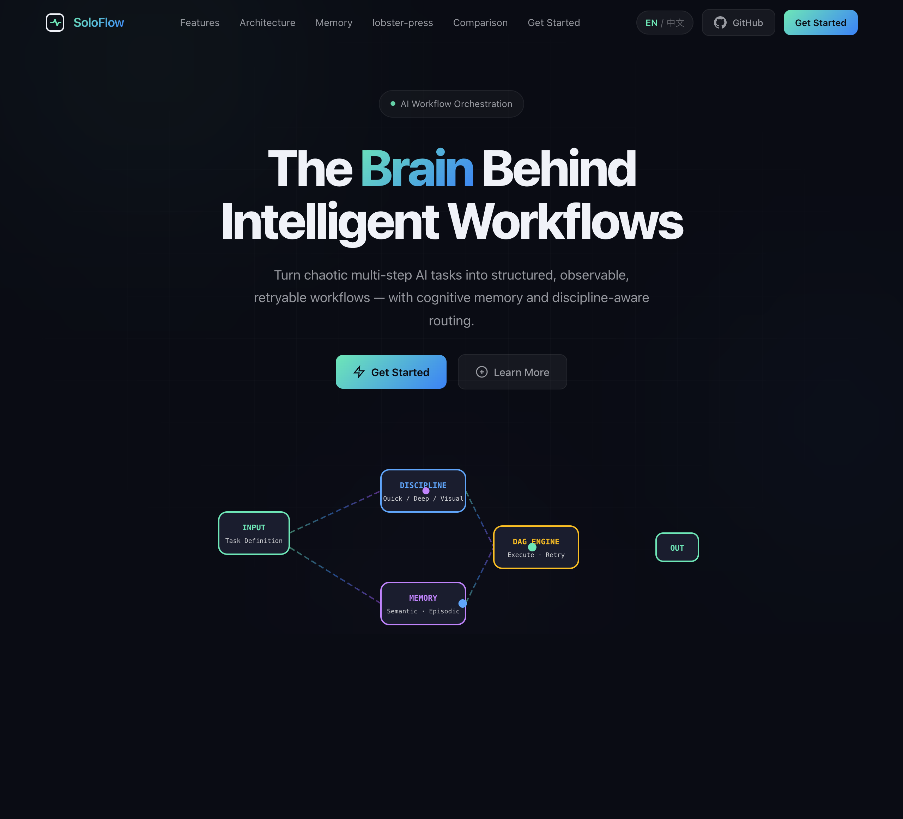
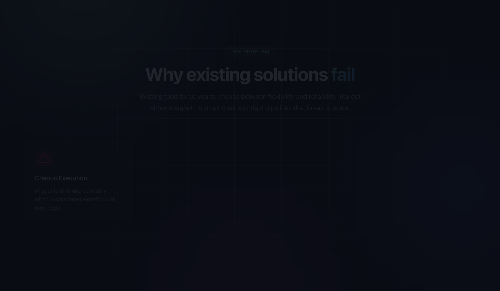
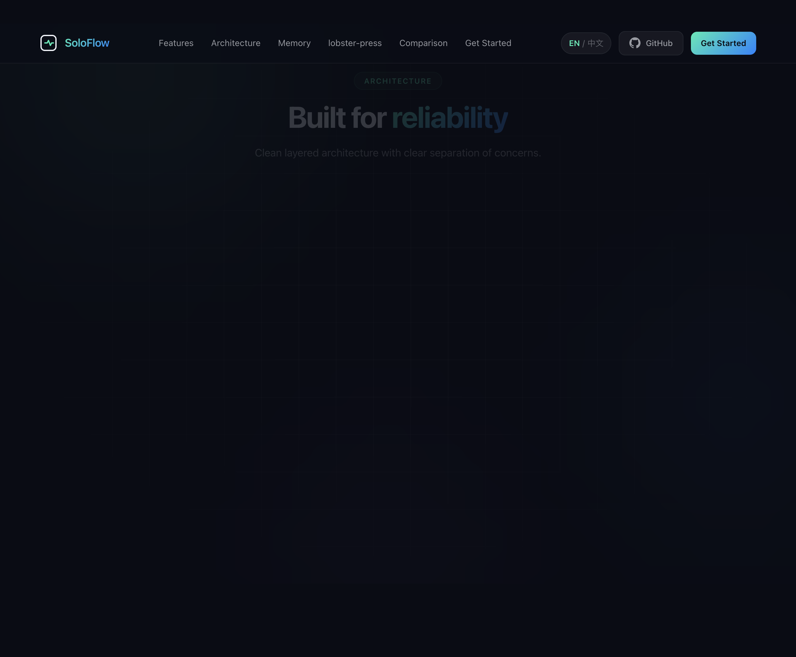
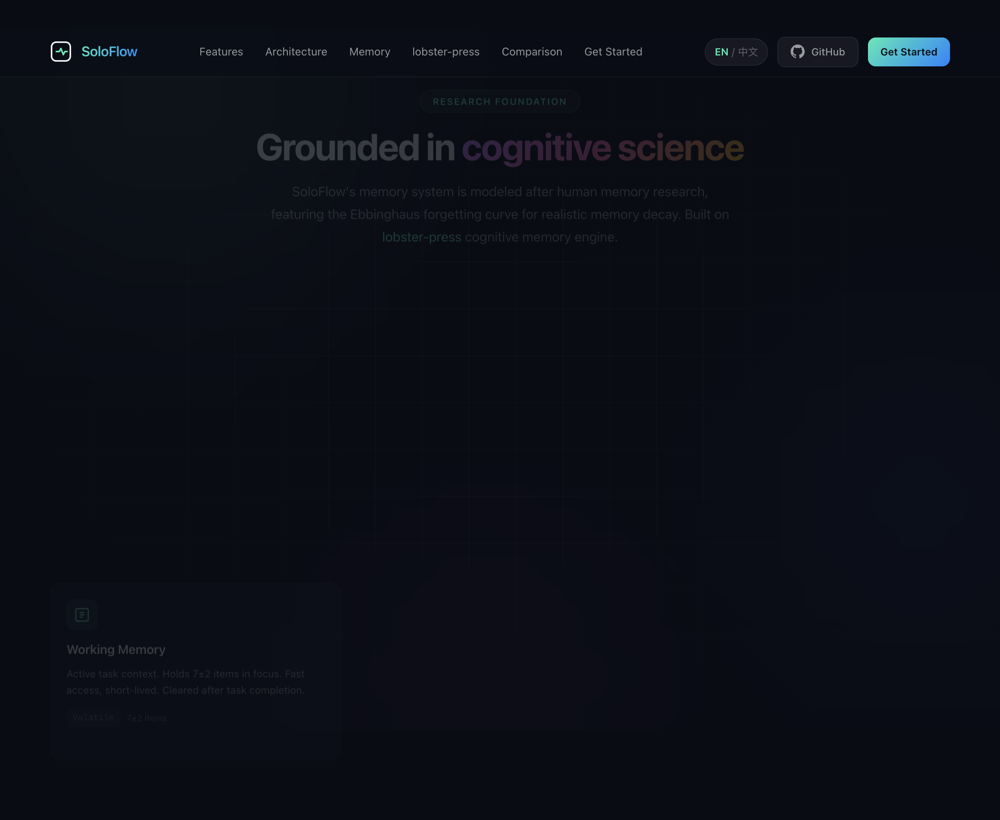
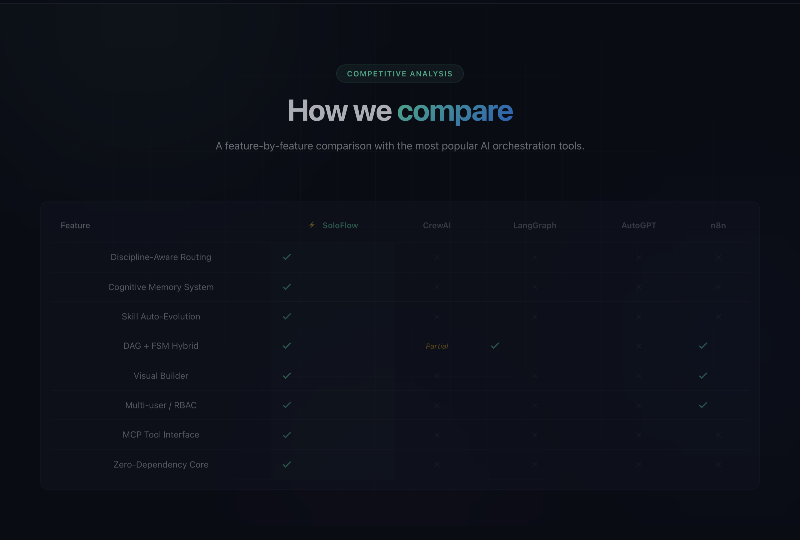

# SoloFlow ⚡

**OpenClaw 工作流编排插件** —— 将复杂多步骤 AI 任务转化为结构化、可观测、可重试的工作流。

[](./LICENSE)
[](https://soloflow.pmparker.net/)
[](./openclaw-plugin/tests)
[](./openclaw-plugin/dist)

---

SoloFlow 是 [OpenClaw](https://github.com/SonicBotMan/openclaw-portable) 的工作流编排层：从任务规划到执行、从记忆沉淀到技能进化，把多步 AI 流程变成可编排、可追踪、可恢复的流水线。

| 资源 | 链接 |
|------|------|
| **产品官网（特性 / 架构 / 对比 / 快速上手）** | [soloflow.pmparker.net](https://soloflow.pmparker.net/) |
| **本仓库** | [github.com/SonicBotMan/SoloFlow](https://github.com/SonicBotMan/SoloFlow) |
| **发行说明** | [Releases](https://github.com/SonicBotMan/SoloFlow/releases)（例如 **v2.0.0**，2026-04） |
| **插件详细文档（英文长文）** | [openclaw-plugin/README.md](./openclaw-plugin/README.md) |

---

## 官网模块预览

以下截图来自 [soloflow.pmparker.net](https://soloflow.pmparker.net/)，便于快速对照产品与文档（点击图片可在新标签打开大图）。

| 首页与流程示意 | 问题陈述 |
|:---:|:---:|
| [](./docs/readme/website-hero.png) | [](./docs/readme/website-problem.png) |

| 四大核心能力 | 编排架构 |
|:---:|:---:|
| [](./docs/readme/website-features.png) | [](./docs/readme/website-architecture.png) |

| 记忆与遗忘曲线 | 能力对比 |
|:---:|:---:|
| [](./docs/readme/website-memory.png) | [](./docs/readme/website-comparison.png) |

| 快速上手（安装与示例代码） |
|:---:|
| [](./docs/readme/website-quickstart.png) |

如需在本地重新导出 PNG，可在仓库内执行：`cd scripts/readme-screenshots && npm install && npm run capture`（默认使用 macOS 上的 Google Chrome；其他系统请设置环境变量 `PUPPETEER_EXECUTABLE_PATH`）。

---

## 核心特性

### 🧠 认知记忆系统

基于 [LobsterPress（lobster-press）](https://github.com/SonicBotMan/lobster-press) 的认知记忆思路：工作 / 情景 / 语义三层记忆，配合遗忘曲线 `R(t) = base × e^(-t/stability)`，让 Agent 在多次运行中持续积累可用上下文。

### 🎯 Discipline-Aware 路由

按任务类型自动路由到合适的执行路径：

- **quick** — 简单查询、格式化、翻译
- **deep** — 深度研究、多步推理、架构设计
- **visual** — UI/UX、视觉与前端相关任务
- **ultrabrain** — 复杂算法、硬逻辑、强推理类任务

### ⚙️ DAG + FSM 混合架构

- **DAG** — 表达步骤依赖，同层可并行调度
- **FSM** — 工作流状态与合法迁移（如 `idle → queued → running`，以及 `completed` / `failed` / `paused` / `cancelled`、重试回 `queued` 等）

两者结合：既有图编排的表达力，又有状态机的可观测与可治理性。

### 🔄 弹性执行

- 步骤级自动重试（可配置）
- 超时与失败收敛策略
- 执行过程日志与状态查询（RPC / MCP）

### 📦 Skill 自动进化

检测重复成功模式，沉淀为可复用 Skill，便于团队共享与二次调用。

### 🔌 MCP 工具

通过 MCP 暴露 5 个工具，供外部 AI 或宿主调用：`soloflow_run`、`soloflow_status`、`soloflow_list`、`soloflow_cancel`、`soloflow_create`。

---

## 仓库结构（插件）

实现代码在 **`openclaw-plugin/`** 下，与官网架构说明一致，核心目录概览：

```
openclaw-plugin/
├── src/
│   ├── core/           # DAG + FSM
│   ├── agents/         # Discipline 执行与路由
│   ├── services/       # 工作流服务、调度、规划等
│   ├── memory/         # 工作 / 情景 / 语义记忆
│   ├── skills/         # Skill 进化与注册
│   ├── coordination/   # 多 Agent 协调
│   ├── vector/         # 向量检索与相关能力
│   ├── visual/         # YAML ↔ 可视化 DAG 同步
│   ├── mcp/            # MCP 工具实现
│   ├── api/            # REST / WebSocket 等
│   ├── rpc/            # JSON-RPC 工作流接口
│   ├── commands/       # /workflow 等命令
│   ├── hooks/          # 生命周期钩子
│   ├── marketplace/    # 市场相关
│   └── multiuser/      # 多用户 / RBAC
├── ui/                 # React Flow 可视化构建器
└── tests/              # TypeScript 测试（`bun test`，当前 175 个用例）
```

更细的模块说明、RPC 示例与路线图见 [**openclaw-plugin/README.md**](./openclaw-plugin/README.md)。

---

## 快速开始

**前置**：安装 [Bun](https://bun.sh)；插件包要求 **Node ≥ 22**（见 `openclaw-plugin/package.json` 的 `engines`）。将本仓库置于你的 OpenClaw 插件目录后执行：

```bash
git clone https://github.com/SonicBotMan/SoloFlow.git
cd SoloFlow/openclaw-plugin

bun install
bun run build

# 可选：运行测试（应与 CI 一致，175 pass）
bun test
```

构建产物由 `openclaw.plugin.json` / 包内 `openclaw.extensions` 声明，供 OpenClaw 加载；在宿主侧使用 **`/workflow`**（及别名）创建与管理工作流。具体挂载方式以 [OpenClaw](https://github.com/SonicBotMan/openclaw-portable) 文档为准。

---

## 竞品对比（能力概览）

| 特性 | SoloFlow | CrewAI | LangGraph | AutoGPT | n8n |
|------|:--------:|:------:|:---------:|:-------:|:---:|
| Discipline-Aware 路由 | ✅ | ❌ | ❌ | ❌ | ❌ |
| 认知记忆系统 | ✅ | ❌ | ❌ | ❌ | ❌ |
| Skill 自动进化 | ✅ | ❌ | ❌ | ❌ | ❌ |
| DAG + FSM 混合 | ✅ | 部分 | ✅ | ❌ | ✅ |
| 可视化构建器 | ✅ | ❌ | ❌ | ❌ | ✅ |
| 多用户/RBAC | ✅ | ❌ | ❌ | ❌ | ✅ |
| OpenClaw 集成 | ✅ | ❌ | ❌ | ❌ | ❌ |
| MCP 工具接口 | ✅ | ❌ | ❌ | ❌ | ❌ |
| 遗忘曲线 | ✅ | ❌ | ❌ | ❌ | ❌ |

---

## 研究基础

- [**oh-my-openagent**](https://github.com/SonicBotMan/oh-my-openagent) — Discipline Agents、Sisyphean Hook、Interview 规划等
- [**lobster-press**](https://github.com/SonicBotMan/lobster-press) — 记忆架构、遗忘曲线、语义层
- [**openclaw-portable**](https://github.com/SonicBotMan/openclaw-portable) — OpenClaw 生态宿主

---

## License

MIT
